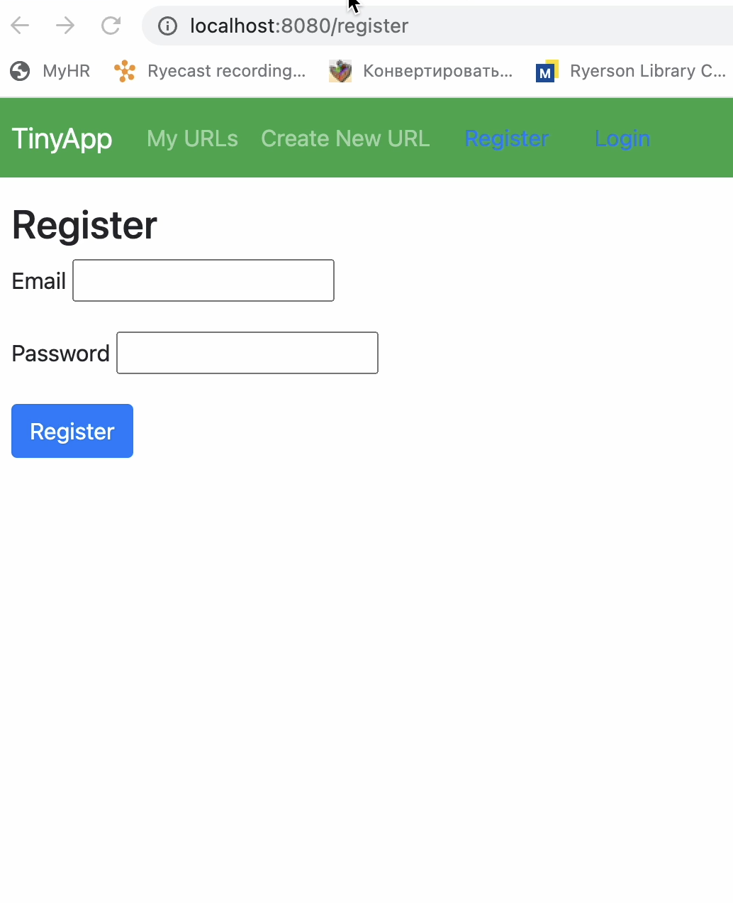
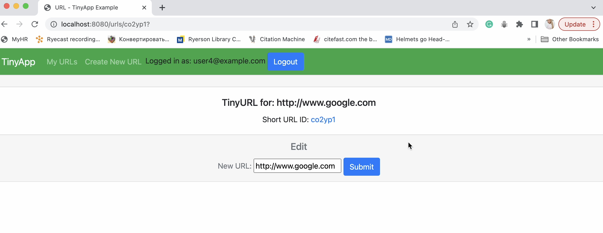
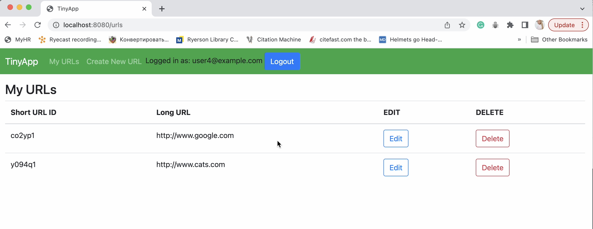

# TinyApp Project

TinyApp is a full stack multipage web application built with Node and Express that allows users to shorten long URLs (à la bit.ly).

## Purpose
**_BEWARE:_ This application was published for learning purposes. It is _not_ intended for use in production-grade software.**

## Project Goals and Outcomes
* To build an HTTP Server that handles requests from the browser (client)
* Use advanced JavaScript and Node concepts and learn more about Express framework
* The Application build:
with authentication protection that reacts appropriately to the user's logged-in state, and permits the user to create, read, update, and delete (CRUD) a simple entity (e.g. blog posts, URL shortener).

## Final Product

### Project DEMO

### Screenshot of register page

### Screenshot of Create/Edit page

### Screenshot of URLs page

## Dependencies

- Node.js
- Express
- EJS
- bcryptjs
- cookie-session

## Getting Started
- Clone the repository [here](https://github.com/KShilina/tinyapp.git)
- Install all dependencies (using the `npm install` command).
- Run the development web server using the `node express_server.js` command.
- Open the application at [click here](http://localhost:8080)

## Features
- The user can create a shortened URLs from a long URLs
- The user can view all their shortened URLs on the TinyApp
- The user can delete and edit their shortened URLs
- The user can login and logout to access their URLs
- Only the creator have an access their shortened URLs 

## How to Use
1. Go to localhost [click here](http://localhost:8080)
2. Register / Login with email and password
3. Create a new shortened URL by submitting a long URL
4. Delete / Edit existing URLs from the list
